# 实验一

实验环境：Windows 11 + Python 3.9。

该实验报告由markdown编写，已上传至[Gitee](https://gitee.com/yongze_yang/NPU-Signal-and-System/blob/master/experiments/ex1.md)。

```python
# 需要声明使用以下库
import numpy as np
import matplotlib.pyplot as plt
import scipy.signal as sgn
```

## 1.绘制下列连续时间信号的波形

### 1.1 $x(t)=cos(2\pi t)[u(t)-u(t-3)]$

```python
#声明导入numpy和matplotlib的pyplot包。
import numpy as np
import matplotlib.pyplot as plt

#将这个实验分装到一个函数中
def ex1_1():
    #规定t的范围为0到2，梯度0.01递增
    t = np.arange(0, 2, 0.01)
    #x(t)函数。使用numpy的heaviside函数作为阶跃函数，第一个参数为自变量，第二个参数1表示取0时函数值为1。
    x = np.cos(2 * np.pi * t) * (np.heaviside(t, 1) - np.heaviside(t - 3, 1))
  
    #作图。横轴为t，纵轴为x
    plt.plot(t, x)
    #以下三句声明横轴和纵轴的标签以及图像
    plt.xlabel("t[s]")
    plt.ylabel("x(t)")
    plt.title("Figure 1.1: x(t)")
    #绘制图像
    plt.show()

#运行这个实验函数
ex1_1()
```

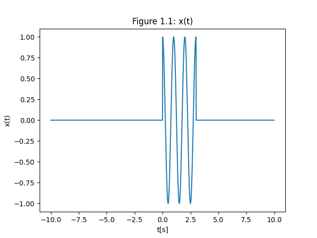

### 1.2 $h(t)=e^{-t}u(t)-e^{-3t}u(t)$

```python
import numpy as np
import matplotlib.pyplot as plt

def ex1_2():
    #t的取值范围0到2
    t = np.arange(0, 2, 0.01)
    #h(t)函数
    h = np.exp(-t) * np.heaviside(t, 1) - np.exp(-3 * t) * np.heaviside(t, 1)
    #作图
    plt.plot(t, h)
    plt.xlabel("t[s]")
    plt.ylabel("h(t)")
    plt.title("Figure 1.2: h(t)")
    plt.show()

ex1_2()
```

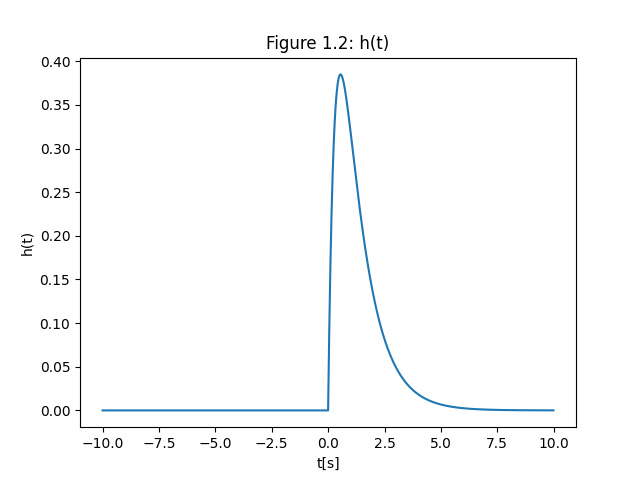

### 1.3 宽度为1，横坐标中心为0，幅度为1的门函数$y(t)=G_1(t)$

```python
import numpy as np
import matplotlib.pyplot as plt

def ex1_3():
    #t的取值范围-2到2
    t = np.arange(-2, 2, 0.01)
    #用阶跃函数实现门函数
    h = np.heaviside(t + 0.5, 1) - np.heaviside(t - 0.5, 1)

    #作图
    plt.plot(t, h)
    plt.xlabel("t[s]")
    plt.ylabel("y(t)")
    plt.title("Figure 1.3: y(t)=G_1(t)")
    plt.show()

ex1_3()
```

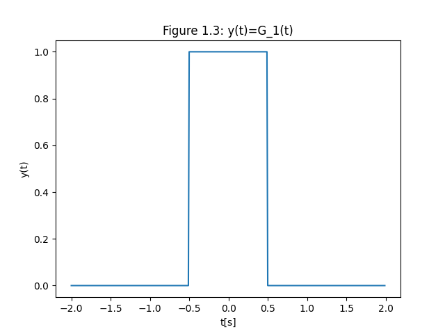

## 2.验证信号的基本运算

### 2.1 以单位门函数为例，画出$y(2t)$、$y(t/2)$、$y(1-2t)$

```python
import numpy as np
import matplotlib.pyplot as plt

def ex2_1():
    t = np.arange(-2, 2, 0.01)
    g = np.heaviside(t + 0.5, 1) - np.heaviside(t - 0.5, 1)
    # y(2t)
    y1 = np.heaviside(2 * t + 0.5, 1) - np.heaviside(2 * t - 0.5, 1)
    # y(t/2)
    y2 = np.heaviside(t / 2 + 0.5, 1) - np.heaviside(t / 2 - 0.5, 1)
    # y(1-2t)
    y3 = np.heaviside((1 - 2 * t) + 0.5, 1) - np.heaviside((1 - 2 * t) - 0.5, 1)
    # 第一幅图像
    plt.subplot(3, 1, 1)
    plt.plot(t, g, t, y1)
    plt.xlabel("t[s]")
    plt.ylabel("y(t)")
    plt.legend(['y(t)', 'y(2t)'])
    plt.title("Figure 2.1: y(t), y(2t), y(t/2) and y(1-2t)")
    # 第二幅图像
    plt.subplot(3, 1, 2)
    plt.plot(t, g, t, y2)
    plt.xlabel("t[s]")
    plt.ylabel("y(t)")
    plt.legend(['y(t)', 'y(t/2)'])
    # 第三幅图像
    plt.subplot(3, 1, 3)
    plt.plot(t, g, t, y3)
    plt.xlabel("t[s]")
    plt.ylabel("y(t)")
    plt.legend(['y(t)', 'y(1-2t)'])
    # 绘图
    plt.show()

ex2_1()
```

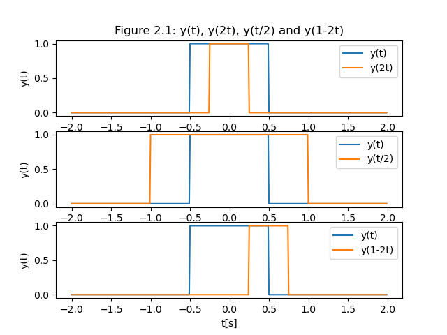

### 2.2 作图$\sin(t)+\sin(\frac{\pi}{4}t)$，观察周期

```python
import numpy as np
import matplotlib.pyplot as plt

def ex2_2():
    t = np.arange(-20, 20, 0.01)
    y = np.sin(t) + np.sin(np.pi * t / 4)
  
    plt.plot(t, y)
    plt.xlabel("t[s]")
    plt.ylabel("y(t)")
    plt.title("Figure 2.2: y(t)=sin(t)+sin(pi*t/4)")
    plt.grid()
    plt.plot()
    plt.show()

ex2_2()
```

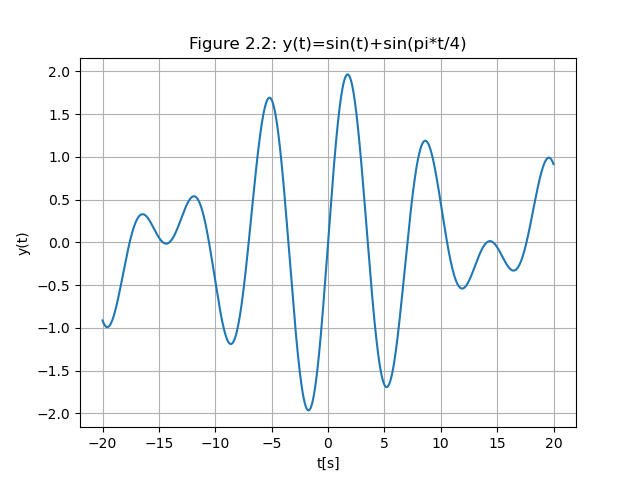

无周期。

### 2.3 作图$\sin(\pi t)+\sin(2\pi t)$，观察周期

```python

import numpy as np
import matplotlib.pyplot as plt

def ex2_3():
    t = np.arange(-10, 10, 0.01)
    y = np.sin(np.pi * t) + np.sin(2 * np.pi * t)
  
    plt.plot(t, y)
    plt.xlabel("t[s]")
    plt.ylabel("y(t)")
    plt.title("Figure 2.3: y(t)=sin(pi*t)+sin(2*pi*t)")
    plt.gird()
    plt.show()

ex2_3()
```

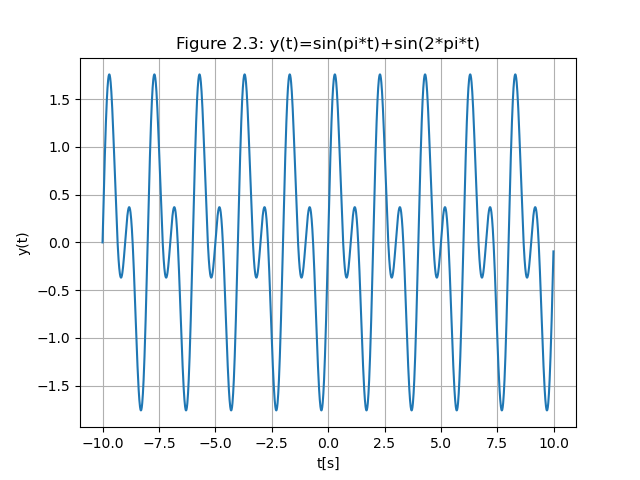

周期为2。

## 3.卷积运算

$x(t)=[e^{-3t}u(t)]*[e^{-t}u(t)]$

### 3.1 理论推导，观察数值

$$
x(t)=[e^{-3t}u(t)]*[e^{-t}u(t)]
=\int^{\infty}_{-\infty}e^{-3\tau}u(\tau) \cdot e^{\tau-t}u(t-\tau)\ {\rm d}\tau 
=\int^t_0e^{-2t-\tau}\rm\ d\tau
=-\frac{1}{2}e^{-3t}+\frac{1}{2}e^{-t}
$$

### 3.2 仿真，获取数值

```python
import numpy as np
import matplotlib.pyplot as plt

def ex3():
    t = np.arange(0, 20, 0.01)
    y1 = np.exp(-3 * t) * np.heaviside(t, 0)
    y2 = np.exp(-t) * np.heaviside(t, 0)
    # 将y1和y2进行卷积。由于计算是离散的点，卷积后需要乘以步长。
    y = sgn.convolve(y1, y2) * 0.01
    plt.plot(np.arange(0, 39.99, 0.01), y, label='simulate')
    # 绘制理论值图像
    t_theory = np.arange(0, 40, 0.1)
    y_theory = -0.5 * np.exp(-3 * t_theory) + 0.5 * np.exp(-t_theory)
    plt.plot(t_theory, y_theory, label='theory')
    plt.xlabel("t[s]")
    plt.ylabel("y(t)")
    plt.title("Figure 3: Convolution")
    plt.legend()
    plt.show()

ex3()

```

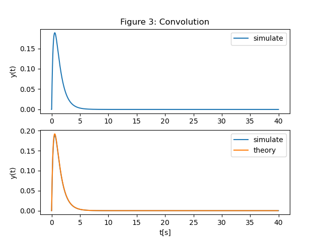

### 3.3 对比理论数值

由图3可知，python仿真值与理论值一致。

## 4.求解系统的零状态响应

设有一个线性时不变系统，微分方程为$r''(t)+3r'(t)+2r(t)=f(t)$,其中$f(t)$为输入信号，$r(t)$为系统输出，$f(t)=e^{-2t}u(t)$.

### 4.1 理论计算，求零状态响应

设$r(t)=e^{\lambda t}$,代入$r''(t)+3r'(t)+2r(t)=0$,解得$\lambda =-1$或$\lambda = -2$。

冲激函数$h(t)=(e^{-t}-e^{-2t})u(t)$.

得到零状态响应：

$$
\begin{align}
r_{ZS}
&= e^{-2t}u(t)*(e^{-t}-e^{-2t})u(t)\\[2ex]
&=\int_{-\infin}^{+\infin}e^{-2\tau}u(\tau)\cdot (e^{-(t-\tau)}-e^{-2(t-\tau)})u(t-\tau){\rm d}\tau\\[2ex]
&=\int_{0}^te^{-2\tau}\cdot(e^{-t+\tau} - e^{-2t+2\tau}){\rm d}\tau\\[2ex]
&=\int_0^t e^{-t-\tau}-e^{-2t}{\rm d}\tau\\[2ex]
&= \left. -e^{-t-\tau}-e^{-2t}\tau \right|_0^t\\[2ex]
&= e^{-t}-(1+t)e^{-2t}
\end{align}
$$

### 4.2 仿真计算

python仿真：

```python
import numpy as np
import matplotlib.pyplot as plt
import scipy.signal as sgn

def ex4():
    # 线性时不变系统
    system = sgn.lti([1], [1, 3, 2])
    # 自变量取值
    t = np.arange(0, 10, 0.01)
    # f(t)
    f = np.exp(-2 * t) * np.heaviside(t, 0)
    # 理论值
    y = np.exp(-t)-(1+t) * np.exp(-2*t)
    plt.subplot(2, 1, 1) #指定图像位置
    plt.plot(t,y) #作图理论值
    plt.ylabel("r_ZS")
    plt.title('Figure 4: Zero-State Response')
    #用lsim函数获取系统零状态响应
    tout, yout, xout = sgn.lsim(system, f, t)
    plt.subplot(2, 1, 2)
    plt.plot(t, y ,label='theory')
    plt.plot(tout, yout, label='simulate') #python仿真值
    plt.xlabel("t[s]")
    plt.ylabel("r_ZS")
    plt.legend()
    plt.show()
  
ex4()
```

图像结果：

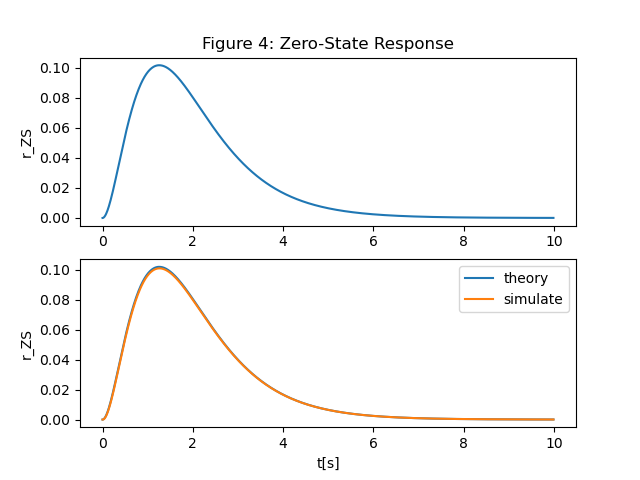

### 4.3 比较差异

由图像可知，python仿真值与理论值一致。

## 5.周期信号的傅里叶展开

定义一个周期信号$f(t)$为矩形脉冲序列，如图所示，设定$E=1$,$\tau =1$,$T=2$.

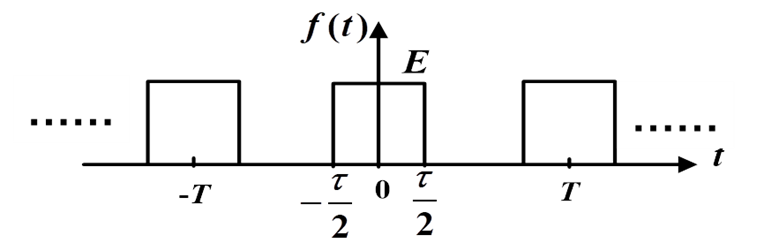

用python模拟该矩形脉冲序列：

```python
import numpy as np
import matplotlib.pyplot as plt

def ex5_origin():
    # 范围从-5到5
    t = np.linspace(-5, 5, 500, endpoint=False)
    # 用sgn.square函数绘制矩形脉冲
    plt.plot(t, 0.5+sgn.square(np.pi*(t+0.5))/2)
    plt.grid() #刻度
    plt.show()
  
ex5_origin()
```

图像如下：

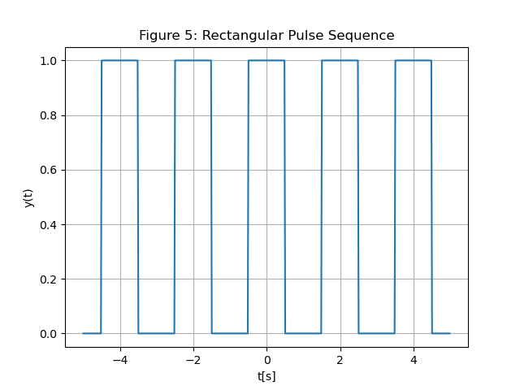

### 5.1 利用三角函数求傅里叶展开

$$
a_0=\frac{1}{T}\int^{\frac{T}{2}}_{-\frac{T}{2}}f(t){\rm d}t=\frac{1}{2}\int^1_{-1}f(t){\rm d}t=\frac{1}{2}\int^{\frac{1}{2}}_{-\frac{1}{2}}1{\rm d}t=\frac{1}{2}
$$

$$
\begin{align}
a_n
&=\frac{2}{T}\int^{\frac{T}{2}}_{-\frac{T}{2}}f(t)\cos n\Omega t{\rm d}t\\[2ex]
&=\frac{2}{2}\int^1_{-1}f(t)\cos n\Omega t{\rm d}t \\[2ex]
&=\int^{\frac{1}{2}}_{-\frac{1}{2}}\cos\Omega nt{\rm d}t  \\[2ex]
&=\frac{2}{n\pi}\sin \frac{n\Omega}{2}\\[2ex]
\end{align}
$$

取$\Omega =\frac{2\pi}{T}=\pi$得

$$
a_n=\frac{2}{n\pi}\sin \frac{n\pi}{2}
$$

$$
b_n=\frac{2}{T}\int^{\frac{T}{2}}_{-\frac{T}{2}}f(t)\sin n\Omega t{\rm d}t=0
$$

故该周期信号利用三角函数的傅里叶展开为

$$
f(t)=\frac{1}{n}+\sum^\infty_{n=1}\frac{2}{n\pi}\sin\frac{n\pi}{2}cosn\pi t
$$

带入数值：

$$
f(t)=\frac{1}{2}+\frac{2}{\pi}\cos(\pi t)-\frac{2}{3\pi}\cos(3\pi t)+\frac{2}{5\pi}\cos(5\pi t)-\frac{2}{7\pi}\cos(7\pi t)+\cdots
$$

### 5.2 仿真前3项和、前5项和

前三项和：

$$
f(t)=\frac{1}{2}+\frac{2}{\pi}\cos(\pi t)-\frac{2}{3\pi}\cos(3\pi t)
$$

前五项和：

$$
f(t)=\frac{1}{2}+\frac{2}{\pi}\cos(\pi t)-\frac{2}{3\pi}\cos(3\pi t)+\frac{2}{5\pi}\cos(5\pi t)
$$

python仿真：

```python
import numpy as np
import matplotlib.pyplot as plt
import scipy.signal as sgn
def ex5_2():
    t = np.arange(-10, 10, 0.01)
    # 原函数
    y = 0.5 + sgn.square(np.pi * (t + 0.5)) / 2
    # 前三项和
    y1 = 0.5 + 2 * np.cos(np.pi * t) / np.pi - 2 * np.cos(3 * np.pi * t) / 3 / np.pi
    # 前五项和
    y2 = y1 + 2 * np.cos(5 * np.pi * t) / 5 / np.pi
    # 绘图
    plt.subplot(2, 1, 1)
    plt.plot(t, y, t, y1)
    plt.ylabel("f(t)")
    plt.legend(['first 3 sums', 'simulate'])
    plt.title("Figure 5.2: First 3 and 5 Sums")
    plt.subplot(2, 1, 2)
    plt.plot(t, y, t, y2)
    plt.xlabel("t[s]")
    plt.ylabel("f(t)")
    plt.legend(['first 5 sums', 'simulate'])
    plt.show()

ex5_2()
```

图像结果：

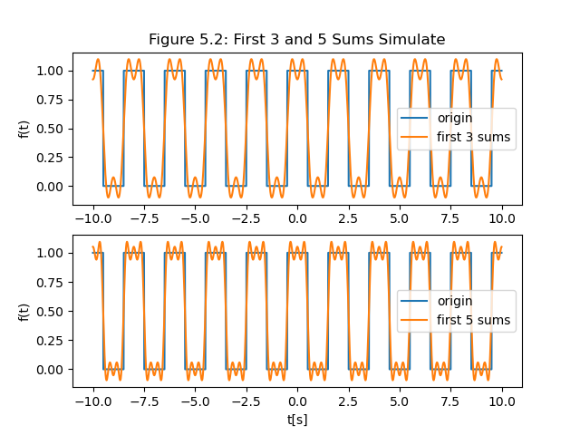

### 5.3 进行傅里叶指数级数展开，写出指数傅里叶级数表达式

由5.1得：

$$
F_0=a_0=\frac{1}{2}\\[2ex] 
F_n=\frac{1}{2}(a_n-jb_n)\\[2ex]
F_{-n}=\frac{1}{2}(a_n+jb_n)\\[2ex]
$$

故：

$$
F_n=F_{-n}=\frac{1}{2}a_n=\frac{2}{n\pi}\sin \frac{n\pi}{2}
$$

$$
\begin{align}
f(t) 
&=\sum^\infty_{n=-\infty}F_ne^{jn\Omega t} \\[2ex] 
&=F_0+\sum^\infty_{n=1}F_ne^{jn\Omega t}+\sum^\infty_{n=1}F_{-n}e^{-jn\Omega t} \\[2ex] 
&=\frac{1}{2}+\sum^\infty_{n=1}\frac{2}{n\pi}\sin \frac{n\pi}{2}e^{jn\Omega t}+\sum^\infty_{n=1}\frac{2}{n\pi}\sin \frac{n\pi}{2}e^{-jn\Omega t} \\[2ex] 
\end{align}
$$

带入数值即：

$$
f(t)=\frac{1}{2}+\frac{1}{\pi}e^{j\pi t}+\frac{1}{\pi}e^{-j\pi t}-\frac{1}{3\pi}e^{3j\pi t}-\frac{1}{3\pi}e^{-3j\pi t}+\frac{1}{5\pi}e^{5j\pi t}+\frac{1}{5\pi}e^{-5j\pi t}+\cdots
$$

### 5.4 仿真前3项和、前5项和

前三项和：

$$
f(t)=\frac{1}{2}+\frac{1}{\pi}e^{j\pi t}+\frac{1}{\pi}e^{-j\pi t}-\frac{1}{3\pi}e^{3j\pi t}-\frac{1}{3\pi}e^{-3j\pi t}
$$

前五项和：

$$
f(t)=\frac{1}{2}+\frac{1}{\pi}e^{j\pi t}+\frac{1}{\pi}e^{-j\pi t}-\frac{1}{3\pi}e^{3j\pi t}-\frac{1}{3\pi}e^{-3j\pi t}+\frac{1}{5\pi}e^{5j\pi t}+\frac{1}{5\pi}e^{-5j\pi t}
$$

python仿真：

```python
import numpy as np
import matplotlib.pyplot as plt
import scipy.signal as sgn

def ex5_3():
    t = np.arange(-10, 10, 0.01)
    # 原函数
    y = 0.5 + sgn.square(np.pi * (t + 0.5)) / 2
    # 前三项和
    y1 = 0.5 + np.exp(1j * np.pi*t)/np.pi + np.exp(-1j * np.pi*t)/np.pi-np.exp(3j * np.pi*t)/np.pi/3-np.exp(-3j * np.pi*t)/np.pi/3
    # 前五项和
    y2 = y1 + np.exp(5j * np.pi*t)/np.pi/5+np.exp(-5j * np.pi*t)/np.pi/5
    plt.subplot(2, 1, 1)
    plt.plot(t, y, t, y1.real) #y1需要取实数
    plt.ylabel("f(t)")
    plt.legend(['origin', 'first 3 sums'])
    plt.title("Figure 5.3: First 3 and 5 Sums Simulate")
    plt.subplot(2, 1, 2)
    plt.plot(t, y, t, y2.real)
    plt.xlabel("t[s]")
    plt.ylabel("f(t)")
    plt.legend(['origin', 'first 5 sums'])
    plt.show()

ex5_3()
```

图像结果：


