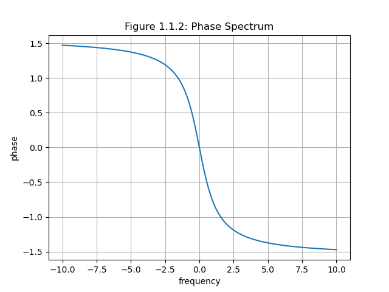

# 实验二

实验环境：Windows 11 + Python 3.9 (IDE: PyCharm)。

该实验报告由markdown编写，已上传至[Gitee](https://gitee.com/yongze_yang/NPU-Signal-and-System/blob/master/experiments/ex2.md)。

该实验使用以下库：

```python
import numpy as np
import matplotlib.pyplot as plt
import scipy.signal as sgn
```


## 一、非周期信号的频谱实验（FT及其性质验证）

### 1.绘制信号波形及其频谱图

求信号$f_1(t)=e^ {-t}\varepsilon(t)$的傅里叶变换$F_1(j\omega)$，并绘制信号波形及其频谱图。

对于$f(t)=e^{-at}\varepsilon(t)\ (a>0)$，其傅里叶变换$F(j\omega)$为：

$$
F(j\omega)=\int^\infty_{-\infty}f(t)e^{-j\omega t}{\rm d}t=\int^\infty_0e^{-at}e^{-j\omega t}{\rm d}t=\frac{1}{a+j\omega}
$$

因此，$F_1(j\omega)=\frac{1}{1+j\omega}$。

图像如下：





代码如下：

```python
def ex1_1():
    t = np.arange(-10, 10, 0.01)
    f = np.exp(-t)*np.heaviside(t,1)
    # 作图，相位图
    plt.plot(t, f)
    plt.grid()
    plt.xlabel("time[s]")
    plt.ylabel("value")
    plt.title("Figure 1.1.1: Waveform")
    plt.show()

    w = np.linspace(-10, 10, 1000)
    H = 1 / (1j * w + 1)

    # 相位谱
    plt.plot(w, np.angle(H))
    plt.grid()
    plt.xlabel("frequency")
    plt.ylabel("phase")
    plt.title("Figure 1.1.2: Phase Spectrum")
    plt.show()

    # 幅度谱
    plt.plot(w, abs(H))
    plt.grid()
    plt.xlabel("frequency")
    plt.ylabel("amplitude")
    plt.title("Figure 1.1.3: Amplitude Spectrum")
    plt.show()
```

### 2.傅里叶变换的尺度变换特性

求信号$f_2(t)=e^ {-2t}\varepsilon(t)$的傅里叶变换$F_2(j\omega)$，并绘制信号波形及其频谱图，并与问题1中图形进行对比，验证傅里叶变换的尺度变换特性。

由实验1.1可推出，$F_2(j\omega)=\frac{1}{2+j\omega}$。

图像如下：


代码如下：

```python
def ex1_2():
    # 时间取值范围
    t = np.arange(-10, 10, 0.01)
    # 函数表达式
    f = np.exp(-2*t)*np.heaviside(2*t, 0)
    # 作图，相位图
    plt.plot(t, f)
    plt.grid()
    plt.xlabel("time[s]")
    plt.ylabel("value")
    plt.title("Figure 1.2.1: Waveform")
    plt.show()

    w = np.linspace(-10, 10, 1000)
    H = 1 / (1j * w + 2)

    # 相位谱
    plt.plot(w, np.angle(H))
    plt.grid()
    plt.xlabel("frequency")
    plt.ylabel("phase")
    plt.title("Figure 1.2.2: Phase Spectrum")
    plt.show()

    # 幅度谱
    plt.plot(w, abs(H))
    plt.grid()
    plt.xlabel("frequency")
    plt.ylabel("amplitude")
    plt.title("Figure 1.2.3: Amplitude Spectrum")
    plt.show()
```


### 3.傅里叶变换的时移特性

求信号$f_3(t)=e^ {-(t-2)}\varepsilon(t)$的傅里叶变换$F_3(j\omega)$，并绘制信号波形及其频谱图，并与问题1中图形进行对比，验证傅里叶变换的时移特性。

易得理论值为
$$
\begin{align}F_3(jw) 
&= \int_{-\infty}^\infty f_3(t)e^{-jwt}{\rm d}t\\[2ex]
&= \int_0^{\infty}e^{-(t-2)}e^{-jwt}{\rm d}t\\[2ex]
&= e^2\int_{0}^{\infty}e^{-t}e^{-jwt}{\rm d}t\\[2ex]
&= \frac{e^2}{1+jw}\end{align}
$$


图像如下：


代码如下：

```python
def ex1_3():
    t = np.arange(-10, 10, 0.01)
    f = np.exp(-(t - 2)) * np.heaviside(t - 2, 0)
    # 作图，相位图
    plt.plot(t, f)
    plt.grid()
    plt.xlabel("time[s]")
    plt.ylabel("value")
    plt.title("Figure 1.3.1: Waveform")
    plt.show()

    w = np.linspace(-10, 10, 1000)
    H = np.exp(-2j * w) / (1j * w + 1)

    # 相位谱
    plt.plot(w, np.angle(H))
    plt.grid()
    plt.xlabel("frequency")
    plt.ylabel("phase")
    plt.title("Figure 1.3.2: Phase Spectrum")
    plt.show()

    # 幅度谱
    plt.plot(w, abs(H))
    plt.grid()
    plt.xlabel("frequency")
    plt.ylabel("amplitude")
    plt.title("Figure 1.3.3: Amplitude Spectrum")
    plt.show()
```


### 4.傅里叶变换的移频特性

求信号$f_4(t)=e^ {-t}\cos{2t}\varepsilon(t)$的傅里叶变换$F_1(j\omega)$，并绘制信号波形及其频谱图，并与问题1中图形进行对比，验证傅里叶变换的移频特性。

FT变换理论值为
$$
\begin{align}
F_4(jw) &= \int_{-\infty}^\infty e^{-t}f_4(t)e^{-jwt}{\rm d}t\\[2ex]
&= \int_0^{\infty} e^{-t}\cos(2t)e^{-jwt}{\rm d}t[2ex]\\
&= \left.\frac{2e^{-(1+jw)t}\sin 2t-(1+jw)e^{-(1+jw)t}\cos 2t}{(1+jw)^2+4} \right|_0^{\infty}\\[2ex]
&= -\frac{-(1+jw)}{(1+jw)^2+4}\\[2ex]
&= \frac{1+jw}{(1+jw)^2+4}
\end{align}
$$


图像如下：


代码如下：

```python
def ex1_4():
    t = np.arange(-10, 10, 0.01)
    f = np.exp(-t)*np.cos(2*t)*np.heaviside(t, 0)
    # 作图，相位图
    plt.plot(t, f)
    plt.grid()
    plt.xlabel("time[s]")
    plt.ylabel("value")
    plt.title("Figure 1.4.1: Waveform")
    plt.show()

    w = np.linspace(-10, 10, 1000)
    H = (1/(1+1j*(w-2))+1/(1+1j*(w+2)))/2

    # 相位谱
    plt.plot(w, np.angle(H))
    plt.grid()
    plt.xlabel("frequency")
    plt.ylabel("phase")
    plt.title("Figure 1.4.2: Phase Spectrum")
    plt.show()

    # 幅度谱
    plt.plot(w, abs(H))
    plt.grid()
    plt.xlabel("frequency")
    plt.ylabel("amplitude")
    plt.title("Figure 1.4.3: Amplitude Spectrum")
    plt.show()
```


### 5.卷积定理

求信号$f_5(t)=f_1(t)*f_2(t)$的傅里叶变换$F_5(j\omega)$，并绘制信号波形及其频谱图，并与$F_1(j\omega)F_2(j\omega)$对比，验证卷积定理。

由卷积得理论值$f_5(t)=f_1(t)*f_2(t)=(e^{-t}-e^{-2t})\varepsilon(t)$。

其傅里叶变换理论值为：
$$
\begin{align}
F_5(jw)&=\int_{-\infty}^{\infty}f_s(t)e^{-jwt}{\rm d}t\\[2ex]
&=\int_0^{\infty}(e^{-t}-e^{-2t})e^{-jwt}{\rm d}t\\[2ex]
&= \frac{1}{1+jw}-\frac{1}{2+jw}
\end{align}
$$

$F_1(j\omega)F_2(j\omega)$理论值为

$$
F_1(j\omega)F_2(j\omega)=\frac{1}{1+j\omega}\cdot\frac{1}{2+j\omega}
$$

图像如下：


由图像可验证卷积定理。

代码如下：

```python
def ex1_5():
    t = np.arange(-10, 10, 0.01)
    f = (np.exp(-t) - np.exp(-2 * t)) * np.heaviside(t, 0)
    # 作图，相位图
    plt.plot(t, f)
    plt.grid()
    plt.xlabel("time[s]")
    plt.ylabel("value")
    plt.title("Figure 1.5.1: Waveform")
    plt.show()

    w = np.linspace(-10, 10, 1000)
    H1 = 1 / (1j * w + 1) - 1 / (1j * w + 2)
    H2 = 1 / ((1j * w + 1) * (1j * w + 2))

    # 相位谱
    plt.plot(w, np.angle(H1))
    plt.grid()
    plt.xlabel("frequency")
    plt.ylabel("phase")
    plt.title("Figure 1.5.2: Phase Spectrum")
    plt.show()

    # 幅度谱
    plt.plot(w, abs(H1))
    plt.grid()
    plt.xlabel("frequency")
    plt.ylabel("amplitude")
    plt.title("Figure 1.5.3: Amplitude Spectrum")
    plt.show()

    # F1*F2相位谱
    plt.plot(w, np.angle(H2))
    plt.grid()
    plt.xlabel("frequency")
    plt.ylabel("phase")
    plt.title("Figure 1.5.4: Phase Spectrum (F1·F2)")
    plt.show()

    # F1*F2幅度谱
    plt.plot(w, abs(H2))
    plt.grid()
    plt.xlabel("frequency")
    plt.ylabel("amplitude")
    plt.title("Figure 1.5.5: Amplitude Spectrum (F1·F2)")
    plt.show()
```


## 二、连续信号的频域分析实验

### 1.三阶巴特沃斯模拟低通滤波器的频域分析

已知某三阶巴特沃斯模拟低通滤波器的频率响应为：

$$
H(j\omega)=\frac{1}{(j\omega)^3+2(j\omega)^2+2(j\omega)+1}
$$

画出该滤波器的幅频响应和相频响应曲线，并判断该系统是否是无失真系统。

幅频曲线和相频曲线图像如下：


代码如下：

```python
def ex2_1():
    # 使用freqs函数
    w, H = sgn.freqs([1], [1, 2, 2, 1], worN=np.linspace(-10, 10, 200))
    # 相位谱
    plt.plot(w, np.angle(H))
    plt.grid()
    plt.xlabel("frequency")
    plt.ylabel("phase")
    plt.title("Figure 2.1.1: Phase Spectrum")
    plt.show()

    # 幅度谱
    plt.plot(w, abs(H))
    plt.grid()
    plt.xlabel("frequency")
    plt.ylabel("amplitude")
    plt.title("Figure 2.1.2: Amplitude Spectrum")
    plt.show()
```


由图像可知，相频曲线不是经过原点的直线，即系统的相频特性在整个频率范围内不与$\omega$成正比，因此该系统不是失真系统。


### 2.系统微分方程的频域分析

已知系统微分方程为：$y'(t)+10\sqrt{3}y(t)=40x(t)$，绘制该系统的幅频响应和相频响应曲线。当输入信号为$f(t)=10cos(10t+50)^{\circ}$时，求输出$y(t)$，并说出输入信号的幅度（相位）和输出信号幅度（相位）之间的关系。

频响函数理论值如下：

$$
y'(t)+10\sqrt{3}y(t)=40x(t)\\[2ex]

j\omega Y(j\omega)+10\sqrt{3} = 40F(j\omega)\\[2ex]

H(j\omega)=\frac{Y(j\omega)}{F(j\omega)}=\frac{40}{j\omega+10\sqrt{3}}
$$

幅频曲线和相频曲线图像如下：


代码如下：

```python
def ex2_2():
    # 利用freqs函数获取w与H
    w, H = sgn.freqs([40], [1, 10 * np.sqrt(3)], worN=np.linspace(-10, 10, 200))
    # 作图，相位图
    plt.plot(w, H)
    plt.grid()
    plt.xlabel("time[s]")
    plt.ylabel("value")
    plt.title("Figure 2.2.1: Waveform")
    plt.show()

    # 相位谱
    plt.plot(w, np.angle(H))
    plt.grid()
    plt.xlabel("frequency")
    plt.ylabel("phase")
    plt.title("Figure 2.2.2: Phase Spectrum")
    plt.show()

    # 幅度谱
    plt.plot(w, abs(H))
    plt.grid()
    plt.xlabel("frequency")
    plt.ylabel("amplitude")
    plt.title("Figure 2.2.3: Amplitude Spectrum")
    plt.show()
```


当$\omega=10$时，有：
$$
\begin{cases}
|H(j10)|=2\\[2ex]
\angle|H(j10)|=-30°
\end{cases}
$$

由$\cos(\omega_0 t+\theta)\to|H(j\omega_0)| \cos ([\omega_0+\theta+\angle H(j\omega_0)])$

$$
\begin{align}
y(t) &= 10|H(j10)|\cos([10t+50°+\angle H(j\omega_0)])\\[2ex]
&= 20\cos(10 t+20°)
\end{align}
$$

关系如下：

相位：输出相位向右移动30°。

幅度：输出幅度变为原来的2倍。

