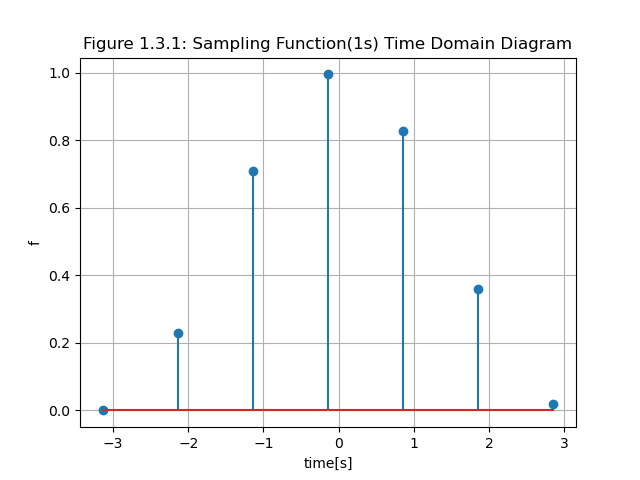

# 实验三 信号抽样与抽样定理

实验环境：Windows 11 + Python 3.9 (IDE: PyCharm)。

该实验报告由markdown编写，已上传至[Gitee](https://gitee.com/yongze_yang/NPU-Signal-and-System/blob/master/experiments/ex3.md)。

该实验使用以下库：

```python
import numpy as np
import matplotlib.pyplot as plt
```

## 1.信号抽样实验

### 问题描述

已知连续信号为$f(t)=0.5(1+\cos t)$，$-\pi \leq t \leq \pi$。对该型号进行抽样，观察间隔从0.5s、变化到1s、变化到2s时的抽样信号频谱混叠程度。要求：绘制原信号和抽样信号的时域图形和幅度谱，验证抽样定理。注：抽样信号的幅度谱绘制三个周期即可。

### 题解

#### 1.1 原函数

原函数的时域图如下：


由升余弦脉冲的频谱函数
$$
F(j\omega)=\frac{8\pi^2\sin(T\omega/2) }{\omega(4\pi^2-T^2\omega^2)}
$$


可得$f(t)$的傅里叶变换为
$$
F(j\omega)=\frac{\sin \pi \omega}{\omega(1-\omega^2)}
$$

故幅度谱如下：


原函数的绘图代码如下：

```python
def ex1_1():
    """
    原函数的时域、幅度谱分析
    """
    t = np.arange(-np.pi, np.pi, 0.01)  # 自变量取值范围，间隔0.01
    f = 0.5 * (1 + np.cos(t)) * (np.heaviside(t + np.pi, 0) - np.heaviside(t - np.pi, 0)) # 原函数，使用阶跃函数限制范围
    # 作图，时域图
    plt.plot(t, f) # 绘图
    plt.grid() # 显示网格
    plt.xlabel("time[s]") # x坐标轴
    plt.ylabel("f(t)") # y坐标轴
    plt.title("Figure 1.1.1: Origin Function Time Domain Diagram") # 标题
    plt.show()

    # 原函数幅度谱
    w = np.linspace(-10, 10, 1000)
    h = np.sin(np.pi * w) / (w * (1 - w ** 2))
    plt.plot(w, h)
    plt.grid()
    plt.xlabel("w")
    plt.ylabel("F(jw)")
    plt.title("Figure 1.1.2: Origin Function Amplitude Spectrum")
    plt.show()
```

#### 1.2 间隔0.5s取样

抽样周期$T=0.5s$，抽样频率$\omega_s=\frac{2\pi}{T}=4\pi$。

间隔0.5s取样后，时域图如下：


由1.1得到原函数的傅里叶变换

$$
F(j\omega)=\frac{\sin \pi \omega}{\omega(1-\omega^2)}
$$

由理想抽样信号的频谱叠加公式

$$
F_\delta(j\omega)=\frac{1}{T}\sum^{+\infty}_{k=-\infty}F[j(\omega-k\omega)]
$$

得该抽样信号频谱

$$
F_\delta(j\omega)=2\sum^{+\infty}_{k=-\infty}F[j(\omega-4\pi k)]
$$

取$k=0,\pm1,\pm2,\pm3$，得到频谱图如下：

定义如下函数，表示参数为$\omega$得原函数的傅里叶变换：

```python
def h(w):
    """
    原函数得傅里叶变换
    :param w: omega
    :return: omega变换后得傅里叶变换
    """
    return np.sin(np.pi * w) / (w * (1 - w ** 2))
```

完整的绘图代码如下：

```python
def ex1_2():
    """
    0.5s抽样的时域、幅度谱分析
    """
    t = np.arange(-np.pi, np.pi, 0.5)  # 自变量取值范围，取样间隔0.5s
    f = 0.5 * (1 + np.cos(t)) * (np.heaviside(t + np.pi, 0) - np.heaviside(t - np.pi, 0))
    # 作图，时域图
    plt.stem(t, f)
    plt.grid()
    plt.xlabel("time[s]")
    plt.ylabel("f")
    plt.title("Figure 1.2.1: Sampling Function(0.5s) Time Domain Diagram")
    plt.show()

    # 0.5s抽样函数幅度谱
    w = np.linspace(-20, 20, 1000)
    F = h(w) # F为0.5s抽样函数的频谱，初始赋值为原函数的傅里叶变换
    for i in range(1, 3): # omega从1递增到3叠加
        F += h(w + i * 4 * np.pi)
        F += h(w - i * 4 * np.pi)
    plt.plot(w, F * 2)
    plt.grid()
    plt.xlabel("w")
    plt.ylabel("F(jw)")
    plt.title("Figure 1.2.2: Sampling Function(0.5s) Amplitude Spectrum")
    plt.show()
```

#### 1.3 间隔1s取样

抽样周期$T=1s$，抽样频率$\omega_s=\frac{2\pi}{T}=2\pi$。

间隔1s取样后，时域图如下：


由1.2得该抽样信号频谱

$$
F_\delta(j\omega)=\sum^{+\infty}_{k=-\infty}F[j(\omega-2\pi k)]
$$

取$k=0,\pm1,\pm2,\cdots,\pm5$，得到频谱图如下：


便于观察，取前三个周期，频谱图如下：


绘图代码如下：

```python
def ex1_3():
    """
    1s抽样的时域、幅度谱分析
    """
    t = np.arange(-np.pi, np.pi, 1.0)  # 自变量取值范围，取样间隔1s
    f = 0.5 * (1 + np.cos(t)) * (np.heaviside(t + np.pi, 0) - np.heaviside(t - np.pi, 0))
    # 作图，时域图
    plt.stem(t, f)
    plt.grid()
    plt.xlabel("time[s]")
    plt.ylabel("f")
    plt.title("Figure 1.3.1: Sampling Function(1s) Time Domain Diagram")
    plt.show()

    # 1s抽样函数幅度谱
    w = np.linspace(-20, 20, 1000)
    F = h(w)  # F为1s抽样函数的频谱，初始赋值为原函数的傅里叶变换
    for i in range(1, 5):  # omega从1递增到5叠加
        F += h(w + i * 2 * np.pi)
        F += h(w - i * 2 * np.pi)
    plt.plot(w, F)
    plt.grid()
    plt.xlabel("w")
    plt.ylabel("F(jw)")
    plt.title("Figure 1.3.2: Sampling Function(1s) Amplitude Spectrum")
    plt.show()
```

#### 1.4 间隔2s取样

抽样周期$T=2s$，抽样频率$\omega_s=\frac{2\pi}{T}=\pi$。

间隔2s取样后，时域图如下：


由1.2得该抽样信号频谱

$$
F_\delta(j\omega)=\frac{1}{2}\sum^{+\infty}_{k=-\infty}F[j(\omega-\pi k)]
$$

取$k=0,\pm1,\pm2,\cdots,\pm10$，得到频谱图如下：


便于观察，取前三个周期，频谱图如下：


绘图代码如下：

```python
def ex1_4():
    """
    2s抽样的时域、幅度谱分析
    """
    t = np.arange(-np.pi, np.pi, 2.0)  # 自变量取值范围，取样间隔2s
    f = 0.5 * (1 + np.cos(t)) * (np.heaviside(t + np.pi, 0) - np.heaviside(t - np.pi, 0))
    # 作图，时域图
    plt.stem(t, f)
    plt.grid()
    plt.xlabel("time[s]")
    plt.ylabel("f")
    plt.title("Figure 1.4.1: Sampling Function(2s) Time Domain Diagram")
    plt.show()

    # 2s抽样函数幅度谱
    w = np.linspace(-20, 20, 1000)
    F = h(w)  # F为2s抽样函数的频谱，初始赋值为原函数的傅里叶变换
    for i in range(1, 10):  # omega从1递增到10叠加
        F += h(w + i * np.pi)
        F += h(w - i * np.pi)
    plt.plot(w, F / 2)
    plt.grid()
    plt.xlabel("w")
    plt.ylabel("F(jw)")
    plt.title("Figure 1.4.2: Sampling Function(2s) Amplitude Spectrum")
    plt.show()
```

#### 1.5 对抽样定理的验证：

该系统为理想抽样系统，周期$T=2\pi$，频率$\omega=1$。三次抽样的抽样间隔$T_s$分别为$0.5s,1s,2s$，抽样频率$\omega_s$分别为$4\pi,2\pi,\pi$。

该系统理想抽样后相邻频谱不发生重叠，当且仅当抽样频率$\omega_s=\frac{2\pi}{T_s}\geq2\omega_s=4$，即$T_s\leq\frac{\pi}{2}\approx 1.57$。有图像可验证，当抽样时间间隔$T_s=0.5s,1s$时，满足$T_s\leq\frac{\pi}{2}$范围，抽样后的频谱图像未发生重叠，而$T_s=2s$时，超出了$T_s\leq\frac{\pi}{2}$范围，相邻的频谱周期发生了混叠。

抽样定理验证完毕。


## 2.信号重建实验

### 问题描述

对题 1 中的信号，假设其$\omega_m = 2$，按照一定间隔进行 抽样，对于抽样之后的信号，采用截止频率为$\omega_c = 1.2\omega_m$的低通滤波器进行信号重建。画出采样间隔为 1s 和 2s 这两种情况下，抽样信号和重建信号的时域波形图，以及重建信号与原信号的绝对误差图。

### 题解


#### 2.1 原理

将抽样信号通过一个截止频率为$\omega_c$、增益为$T$的低通滤波器，就可以不失真地复原出原信号。低通滤波器的冲激响应为
$$
h(t)=T\frac{\omega_c}{\pi}{\rm Sa}(\omega_ct)
$$
信号通过低通滤波器的输出为

$$
f(t)=T\frac{\omega_c}{\pi}\sum^{+\infty}_{k=-\infty}f(kT){\rm Sa}(\omega_c(t-kT))
$$

将条件$\omega_c=1.2\omega_m=2.4$，$T=1s,2s$带入，得

$$
h(t)=T\frac{2.4}{\pi}{\rm Sa}(2.4t)
$$

$$
f(t)=T\frac{2.4}{\pi}\sum^{+\infty}_{k=-\infty}f(kT){\rm Sa}(2.4*(t-kT))
$$

#### 2.2 $T=1s$时

由于原函数与重建函数都是离散的点，因此用茎叶图表示。差值用折线表示。

抽样信号和重建信号的时域波形以及两者之间的绝对误差如下图：


代码如下：

```python
def ex2_1():
    """
    T=1s时的信号重建与误差分析
    """
    t1 = np.arange(-np.pi, np.pi, 1)  # 自变量取值范围，间隔1
    F1 = f0(0) * np.sinc(2.4 * t1)    # 重建信号初始值
    for i in range(1, 10):  # K从1递增到10叠加
        F1 += f0(i*1)*np.sinc(2.4*(t1-i*1))
        F1 += f0(i*1)*np.sinc(2.4*(t1+i*1))

    plt.stem(t1, F1 * 2.4 * 1 / np.pi, label='Reconstruction', markerfmt='rD')  # 重建函数
    plt.stem(t1, f0(t1), label='Origin', markerfmt='gD')  # 原函数
    plt.plot(t1, abs(F1 * 2.4 * 1 / np.pi - f0(t1)), label='Difference', color='orange')  # 差值的绝对值
    plt.grid()
    plt.xlabel("time[s]")
    plt.ylabel("f")
    plt.title("Figure 2.1: Sampling Function(1s) Reconstruction")
    plt.legend()
    plt.show()
```


#### 2.3 $T=2s$时

抽样信号和重建信号的时域波形以及两者之间的绝对误差如下图：


代码如下：

```python
def ex2_2():
    t2 = np.arange(-np.pi, np.pi, 2)  # 自变量取值范围，间隔2
    F2 = f0(0) * np.sinc(2.4 * t2)    # 重建信号初始值

    for i in range(1, 10):  # K从1递增到10叠加
        F2 += f0(i*2)*np.sinc(2.4*(t2-i*2))
        F2 += f0(i*2)*np.sinc(2.4*(t2+i*2))

    plt.stem(t2, F2 * 2.4 * 2 / np.pi, label='Reconstruction', markerfmt='rD')
    plt.stem(t2, f0(t2), label='Origin', markerfmt='gD')
    plt.plot(t2, abs(F2 * 2.4 * 2 / np.pi-f0(t2)), label='Difference', color='orange')
    plt.grid()
    plt.xlabel("time[s]")
    plt.ylabel("f")
    plt.title("Figure 2.2: Sampling Function(2s) Reconstruction")
    plt.legend()
    plt.show()
```

#### 2.4 结论

由此可以验证，当抽样间隔越小，其重建函数与原函数之间的误差越小。当低通滤波器的截止频率不满足香农抽样定理时，抽样信号的重建信号难以还原出原信号，从而证明了香农抽样定理的正确性。
