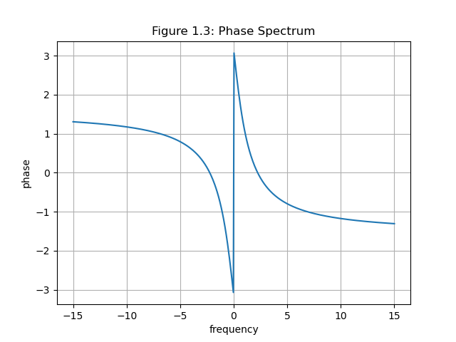

# 实验四 连续和离散时间信号与系统的复频域分析实验


2019302768 杨永泽


## 一、s域实验（Python）

该实验使用Python完成，需要先导入如下库并声明如下变量：

```python
import sympy
import numpy as np
import matplotlib.pyplot as plt
from scipy.signal import freqs, tf2zpk, lti, impulse2

sympy.init_printing()
t, s = sympy.symbols('t, s')
```

### 1.1 求下列信号的LT变换，说明收敛域

$f_1(t)=e^{-2t}\varepsilon(t)$，理论值$F_1(s)=\frac{1}{s+2}\ (\sigma>0)$

$f_2(t)=\sin{(2t)}\varepsilon(t)$，理论值$F_2(s)=\frac{2}{s^2+4}\ (\sigma>0)$

$f_3(t)=\delta(t)+e^{2t}\varepsilon(t)-\frac{4}{3}e^{-t}\varepsilon(t)$，理论值$F_3(s)=1-\frac{4}{3s+3}+\frac{1}{s-2}\ (\sigma>2)$

Python中定义计算拉普拉斯变换的函数：

```python
def L(f):
    '''
    对函数求拉普拉斯变换
    :param f: 函数
    :return: 函数的拉普拉斯变换
    '''
    return sympy.laplace_transform(f, t, s, noconds=True)
```

本题Python代码如下：

```python
def ex1_1():
    fs = [sympy.exp(-2 * t) * sympy.Heaviside(t, 1),  # f1
          sympy.sin(2 * t) * sympy.Heaviside(t, 1),  # f2
          sympy.DiracDelta(t) + sympy.exp(2 * t) * sympy.Heaviside(t, 1) - 4 * sympy.exp(-t) * sympy.Heaviside(t, 1) / 3
          # f3
          ]
    for f in fs:  # 对于函数集中的每一个函数
        print("result: ", L(f.apart(t)))  # 输出拉普拉斯变换
        print()
```

控制台结果输出：

```powershell
result:  1/(s + 2)

result:  2/(s**2 + 4)

result:  1 - 4/(3*s + 3) + 1/(s - 2)

```

将输出转化为公式，并添加收敛域：
$$
F_1(s)=\frac{1}{s+2}\ (\sigma>0)
$$

$$
F_2(s)=\frac{2}{s^2+4}\ (\sigma>0)
$$

$$
F_3(s)=1-\frac{4}{3s+3}+\frac{1}{s-2}\ (\sigma>2)
$$

与理论值对比，计算结果与理论值相符。


### 1.2 求下列信号的拉普拉斯反变换

$F_1(s)=\frac{4s+5}{s^2+5s+6}$，理论值$f_1(t)=(7-3e^t)e^{-3t}\varepsilon(t)$

$F_2(s)=\frac{3s}{(s+4)(s+2)}$，理论值$f_2(t)=3(2-e^{2t})e^{-4t}\varepsilon(t)$

$F_3(s)=\frac{s+5}{s(s^2+2s+5)}$，理论值$f_3(t)=(e^{t}-\cos{2t})e^{-t}\varepsilon(t)$


Python中定义拉普拉斯逆变换函数如下：

```python
def invL(F):
    '''
    对函数求拉普拉斯逆变换
    :param F:
    :return: 函数的拉普拉斯逆变换
    '''
    return sympy.inverse_laplace_transform(F, s, t)
```

本题Python代码如下：

```python
def ex1_2():
    fs = [(4 * s + 5) / (s ** 2 + 5 * s + 6),   # F1
          (3 * s) / ((s + 4) * (s + 2)),        # F2
          (s + 5) / (s * (s ** 2 + 2 * s + 5))  # F3
          ]
    for f in fs:
        print("apart:  ", f.apart(s)) # 将函数化简
        print("result: ", invL(f.apart(s))) # 反拉普拉斯变换
        print()
```

控制台结果输出：

```powershell
apart:   7/(s + 3) - 3/(s + 2)
result:  (7 - 3*exp(t))*exp(-3*t)*Heaviside(t)

apart:   6/(s + 4) - 3/(s + 2)
result:  3*(2 - exp(2*t))*exp(-4*t)*Heaviside(t)

apart:   -(s + 1)/(s**2 + 2*s + 5) + 1/s
result:  (exp(t) - cos(2*t))*exp(-t)*Heaviside(t)
```

将控制台结果转换为公式：
$$
F_1(s)=\frac{4s+5}{s^2+5s+6}=\frac{7}{s+3}-\frac{3}{s+2}
$$

$$
f_1(t)=(7-3e^t)e^{-3t}\varepsilon(t)
$$


$$
F_2(s)=\frac{3s}{(s+4)(s+2)}=\frac{6}{s+4}-\frac{3}{s+2}
$$

$$
f_2(t)=3(2-e^{2t})e^{-4t}\varepsilon(t)
$$


$$
F_3(s)=\frac{s+5}{s(s^2+2s+5)}=\frac{1}{s}-\frac{s+1}{s^2+2s+5}
$$

$$
f_3(t)=(e^{t}-\cos{2t})e^{-t}\varepsilon(t)
$$

与理论值对比，计算结果与理论值相符。

### 1.3 LT反变换部分分式展开法

求$f(s)=\frac{s^2+4s+5}{s^2+5s+6}$的部分分式展开式。

理论值：
$$
F(s)=\frac{s^2+4s+5}{s^2+5s+6}=\frac{1}{s+2}-\frac{2}{s+3}+1
$$
本题Python代码如下：

```python
def ex1_3():
    f = (s ** 2 + 4 * s + 5) / (s ** 2 + 5 * s + 6)  # F(s)
    print(f.apart(s))   # 展开并输出到控制台
```

控制台输出：

```python
1 - 2/(s + 3) + 1/(s + 2)
```

转换为公式：
$$
F(s)=\frac{1}{s+2}-\frac{2}{s+3}+1
$$
理论值与计算结果相符。


### 1.4 

已知某线性时不变系统的系统函数$H(s)=\frac{s-1}{s^2+3s+2}$，绘制该系统的极零图，求出并绘制该系统的单位冲激响应和频率响应曲线，判断系统的稳定性。

#### 题解

该系统的极零图如下：


单位冲激响应如下：


相频响应图如下：



幅频响应如下：


绘图所用的Python代码如下：

```python
def ex1_4():
    z, p, _ = tf2zpk([1, -1], [1, 3, 2])
    # 绘制零点与极值点
    plt.scatter(z.real, np.imag(z), label = 'Zero Point')
    plt.scatter(p.real, np.imag(p), marker='x', label = 'Pole')
    # 作图
    plt.title("Figure 1.1: Pole-Zero Plot")
    plt.xlabel('σ')
    plt.ylabel('jw')
    plt.legend()
    plt.grid()
    plt.show()

    # 单位冲击响应
    t1, y1 = impulse2(lti([1, -1], [1, 3, 2]))
    plt.plot(t1, y1)
    plt.title("Figure 1.2: Impulse Response")
    plt.xlabel('t')
    plt.ylabel('h(t)')
    plt.grid()
    plt.show()

    # 频响
    w, H = freqs([1, -1], [1, 3, 2], worN=np.linspace(-15, 15, 500))

    # 相位谱
    plt.plot(w, np.angle(H))
    plt.grid()
    plt.xlabel("frequency")
    plt.ylabel("phase")
    plt.title("Figure 1.3: Phase Spectrum")
    plt.show()

    # 幅度谱
    plt.plot(w, abs(H))
    plt.grid()
    plt.xlabel("frequency")
    plt.ylabel("amplitude")
    plt.title("Figure 1.4: Amplitude Spectrum")
    plt.show()
```

使用L-H准则判定系统的稳定性。

判定矩阵：

| 1    | 2    |
| ---- | ---- |
| 3    | 0    |
| 2    | 0    |

罗斯-霍维茨阵列第一列都为正数未变号，因此，系统稳定。


## 二、z域实验(MATLAB)

### 2.1 ZT 实验

利用 MATLAB 求信号 $f(k)=2^{k-1}\varepsilon(k)$ 的 ZT 变换，并说明收敛域。

#### 题解

$f(k)=2^{k-1}\varepsilon(k)$理论值为$F(z)=\frac{z}{2(z-2)}\ (|z|>2)$

代码如下：

```matlab
clear all;
clc;
syms k z;
f = 2^(k-1) .* stepfun(k,0);%f(k)
F = ztrans(f,k,z);%Z变换
```

控制台输出如下：

```
F =

z/(2*(z-2))
```

转换为公式并添加收敛域：
$$
F(z)=\frac{z}{2(z-2)}\ (|z|>2)
$$
与理论值对比，计算结果相符。


### 2.2 求信号的单边反 z 变换

$F(z) = \frac{2z^2-0.5z}{z^2-0.5z-0.5}$，理论值$f(k)=(1+(-0.5)^k)\varepsilon(k)$。

MATLAB代码如下：

```matlab
clear all;
clc;
syms z;
f = (2*z^2 - 0.5*z) / (z^2 - 0.5*z - 0.5);%原函数
F = iztrans(F);   %单边反z变换
F
```

控制台输出如下：

```
F =
 
(-1/2)^n + 1

```

转换为公式：
$$
f(k)=(1+(-0.5)^k)\varepsilon(k)
$$
与理论值对比，计算结果相符。


### 2.3 ZT 反变换部分分式展示式

求信号的部分分式展开式，并计算单边反 z 变换

$F(z)=\frac{z}{2z^2-3z+1}=\frac{1}{z-1}-\frac{1}{2z-1}$，变换为$f(k)=(1-(0.5)^k)\varepsilon(k-1)$

MATLAB代码如下：

```matlab
clear all;
clc;
[A B C] = residuez([1],[2 -3 1])
syms z;

F = z / (2*z^2 - 3*z + 1);%展开后的原函数
f = iztrans(F); %单边反z变换
f
```

控制台输出如下：

```
A =

    1.0000
   -0.5000


B =

    1.0000
    0.5000


C =

     []

 
f =
 
1 - (1/2)^n

```

转换为公式：
$$
F(z)=\frac{z}{2z^2-3z+1}=\frac{1}{z-1}-\frac{1}{2z-1}
$$

$$
f(k)=(1-(0.5)^k)\varepsilon(k-1)
$$

与理论值对比，计算结果相符。


### 2.4 极零图

利用 MATLAB 画出下列系统函数的极零图以及对应的时域单位函数响应h(k)的波形，并分析系统函数的极点对于时域波形的影响。


#### 1. $H_1(z)$

$$
H_1(z)=\frac{z}{z-0.8}
$$

MATLAB代码

```matlab
clear all;
clc;

subplot(1,2,1);
zplane(1,[1 -0.8]) %极零图
xlabel("real part");
ylabel("imaginary part");
title('Figure 2.1.1 Polar-Zero Plot');

subplot(1,2,2);
[h,t] = impz(1,[1 -0.8]);%时域单位函数响应 h(k) 的波形
stem(t,h); %茎叶图
xlabel("k");
ylabel("h(k)");
title('Figure 2.1.2 Impulse Response');

```

极零图、时域单位函数响应波形如下：


#### 2. $H_2(z)$

$$
H_2(z)=\frac{z}{z-1}
$$

MATLAB代码

```matlab
clear all;
clc;

subplot(1,2,1);
zplane(1,[1 -1]) %极零图
xlabel("real part");
ylabel("imaginary part");
title('Figure 2.2.1 Polar-Zero Plot');

subplot(1,2,2);
[h,t] = impz(1,[1 -1]);%时域单位函数响应 h(k) 的波形
stem(t,h); %茎叶图
xlabel("k");
ylabel("h(k)");
title('Figure 2.2.2 Impulse Response');

```

极零图、时域单位函数响应波形如下：


#### 3. $H_3(z)$

$$
H_3(z)=\frac{z}{z-1.2}
$$

MATLAB代码

```matlab
clear all;
clc;

subplot(1,2,1);
zplane(1,[1 -1.2]) %极零图
xlabel("real part");
ylabel("imaginary part");
title('Figure 2.3.1 Polar-Zero Plot');

subplot(1,2,2);
[h,t] = impz(1,[1 -0.8]);%时域单位函数响应 h(k) 的波形
stem(t,h); %茎叶图
xlabel("k");
ylabel("h(k)");
title('Figure 2.3.2 Impulse Response');

```

极零图、时域单位函数响应波形如下：


#### 4. $H_4(z)$

$$
H_4(z)=\frac{z}{z+0.8}
$$

MATLAB代码

```matlab
clear all;
clc;

subplot(1,2,1);
zplane(1,[1 0.8]) %极零图
xlabel("real part");
ylabel("imaginary part");
title('Figure 2.4.1 Polar-Zero Plot');

subplot(1,2,2);
[h,t] = impz(1,[1 -0.8]);%时域单位函数响应 h(k) 的波形
stem(t,h); %茎叶图
xlabel("k");
ylabel("h(k)");
title('Figure 2.4.2 Impulse Response');

```

极零图、时域单位函数响应波形如下：


#### 5. $H_5(z)$

$$
H_5(z)=\frac{z}{z^2-1.2z+0.72}
$$

MATLAB代码

```matlab
clear all;
clc;

subplot(1,2,1);
zplane(1,[1 -1.2 0.72]) %极零图
xlabel("real part");
ylabel("imaginary part");
title('Figure 2.5.1 Polar-Zero Plot');

subplot(1,2,2);
[h,t] = impz(1,[1 -1.2 0.72]);%时域单位函数响应 h(k) 的波形
stem(t,h); %茎叶图
xlabel("k");
ylabel("h(k)");
title('Figure 2.5.2 Impulse Response');

```

极零图、时域单位函数响应波形如下：


#### 6. $H_6(z)$

$$
H_6(z)=\frac{z}{z^2-1.6z+1}
$$

MATLAB代码

```matlab
clear all;
clc;

subplot(1,2,1);
zplane(1,[1 -1.6 1]) %极零图
xlabel("real part");
ylabel("imaginary part");
title('Figure 2.6.1 Polar-Zero Plot');

subplot(1,2,2);
[h,t] = impz(1,[1 -1.6 1]);%时域单位函数响应 h(k) 的波形
stem(t,h); %茎叶图
xlabel("k");
ylabel("h(k)");
title('Figure 2.6.2 Impulse Response');

```

极零图、时域单位函数响应波形如下：


#### 7. $H_7(z)$

$$
H_7(z)=\frac{z}{z^2-2z+1.36}
$$

MATLAB代码

```matlab
clear all;
clc;

subplot(1,2,1);
zplane(1,[1 -2 1.36]) %极零图
xlabel("real part");
ylabel("imaginary part");
title('Figure 2.7.1 Polar-Zero Plot');

subplot(1,2,2);
[h,t] = impz(1,[1 -2 1.36]);%时域单位函数响应 h(k) 的波形
stem(t,h); %茎叶图
xlabel("k");
ylabel("h(k)");
title('Figure 2.7.2 Impulse Response');

```

极零图、时域单位函数响应波形如下：


规律总结：对于一二阶极点，如果极点在**圆内**，信号**减幅**振荡；极点在**圆外**，信号**增幅**震荡；极点在**圆上**，信号**等幅**振荡。
